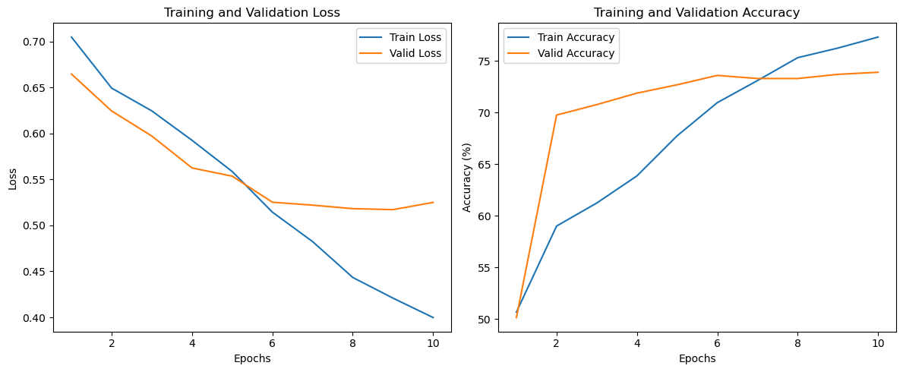

**[English](README.md)** | **[中文](README-ZH.md)**

---

### AI × Biology × Robotics

**An AI developer with a biology background, exploring the intersection of life, agents, and engineered systems.**

> **"Boundaries are not endings, but beginnings."**

[Blog](https://linfengchen.com)

---

## About Me

At twenty, standing at the intersection of two worlds.

Two questions have always fascinated me:

- How life encodes itself
- How intelligence acts upon reality

Thus, my interests converge along three threads:

- **AI for Biology**: Using deep learning to understand biological information and sequences
- **Embodied Intelligence**: Moving agents from "reasoning" to "acting"
- **Modular Systems**: Building composable, scalable, and reusable engineering systems

I aim to build more than just code that "runs" —
but **systems that carry ideas, map reality, and continuously evolve.**

---

## Current Focus

- Biological sequence modeling (DNA / RNA / expression prediction)
- Agent systems and embodied intelligence
- Deep learning system design and modular abstraction
- Cross-disciplinary applications of AI and science

---

## Featured Projects

### 1. [DNA_CNN_predict](https://github.com/Linmoqian/DNA_CNN_predict)

**CNN-based DNA Expression Prediction**

Using convolutional neural networks to predict expression patterns from DNA sequences, exploring the mapping between sequence structure and biological function.

**Tech Stack:** `Python` `PyTorch` `CNN` `Bioinformatics`

**Highlights:**

- Designed for DNA sequence modeling tasks
- Includes data preprocessing, model training, and evaluation pipeline
- Focuses on local pattern recognition in biological sequences

---

### 2. [claw_arm](https://github.com/Linmoqian/claw_arm)

**Agent-controlled Robotic Arm**

.gif>)

Integrating agent logic into robotic arm control, forming a closed loop between decision-making and physical execution.

**Tech Stack:** `Python` `Agent` `Robotics` `Control`

**Highlights:**

- Designed for embodied intelligence and intelligent control scenarios
- Focuses on "perception–decision–execution" system integration
- Explores the practical deployment of agents in real-world tasks

---

### 3. [block-builder](https://github.com/Linmoqian/block-builder)

**Building-block Deep Learning System**

Decomposing and recomposing deep learning pipelines into modular components, reducing experiment costs and improving system reusability and scalability.

**Tech Stack:** `Python` `Deep Learning` `System Design`

**Highlights:**

- Emphasizes modular design of model training pipelines
- Designed for experiment management and rapid iteration
- Focuses on "how to build" rather than just "single-run results"

---

## Reflections

ATCG writes life's most ancient program,
each base pair, an information encoding spanning billions of years.

0 and 1 carry the pulse of a new era,
every loop, every gradient update, approaching the boundary of some "artificial understanding."

When the microscope's eyepiece meets the display's glow, I see:

- A river flowing for four billion years: from single cells to consciousness
- A river flowing for merely half a century: from computation to creation

The true miracle does not happen at the center of any single discipline,
but in those **boundary-blurring, collision-stirring, yet-to-be-named intersections.**

---

## Philosophy

### **The Pen is an Extension of the Mind**

Text is not merely a medium, but the projection of thought onto paper.
Writing, for me, is not just expression — it is the process of organizing the world and reconstructing the self.

### **Engineering is the Embodiment of Thought**

Theory that cannot be grounded cannot truly touch reality.
I want to transform abstract ideas into systems that run, can be verified, and can be iterated.

### **Beyond Technology, Reflection Remains**

Technology can carry us further,
but what truly determines "why we move forward" remains internal judgment, values, and inquiry.

---
Kant said, two things fill the mind with ever-increasing awe —

**The starry heavens above**: The vastness and order of the universe, the motion and laws of all things

**The moral law within**: The depth and radiance of humanity, the freedom and dignity of the soul

Between exploring life and writing code, I often pause to gaze at the stars and examine my heart. Technology can reach the stars, but only reflection lets the soul take root.

